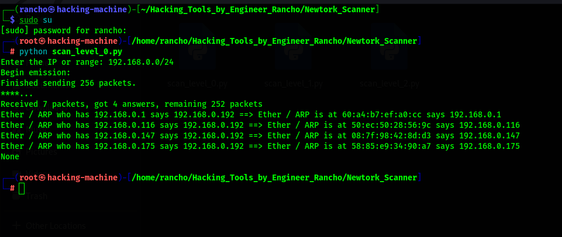
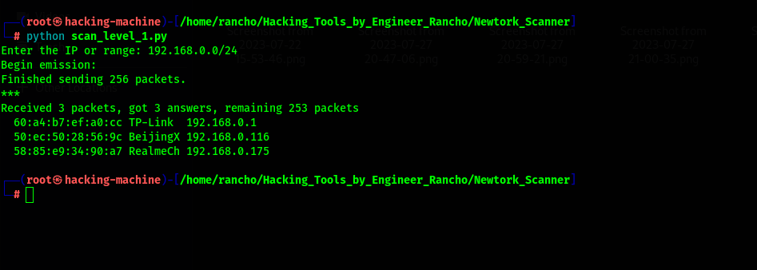
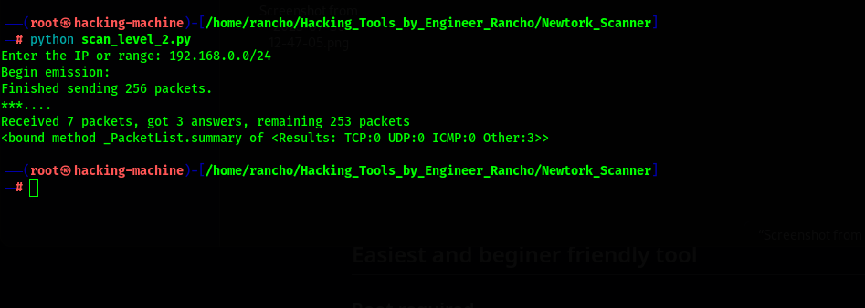

# Network_scanner
This tool is a set of undergoing python tools that works on network Monitoring and Hacking Network connected to the device..

## Easiest and beginer friendly tool

### Root required

### Usage
```
git clone https://github.com/EngineerRancho/Network_scanner
cd Network_scanner
sudo su
###python scan_level_0.py
```





## This set of program with three levels, is able to monitor and helpful in hacking the Network connected to the System.
## These programs are on three different levels to discover additional information about the network connected to the system..
